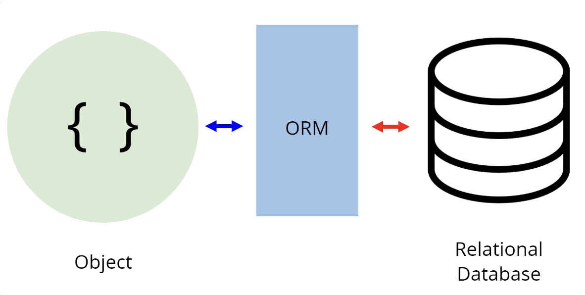
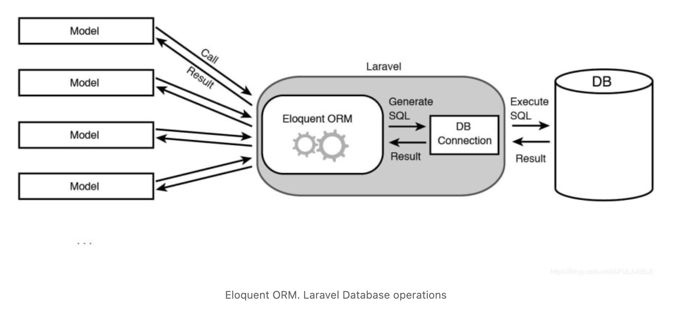
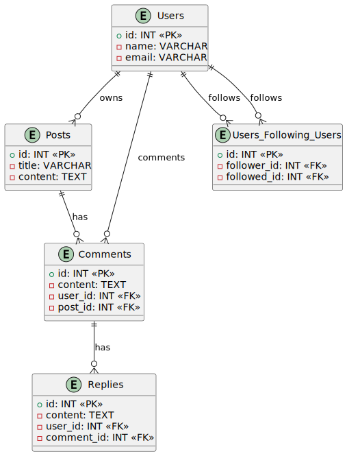

# About
In this blog post we will dive into the essence of every modern web-framework. You will get perice instructions on everything you need to know in order to build Laravel-Applications with Eloquent

We will go through the following topics: 
* Definition of "ORM" & Eloquent
* Useful tools
* Defining every type of database-relation in Eloquent 
* Using eloquent queries in the code
* Implementing a practical example

# Introduction to Eloquent
Okay okay okay... Are you ready kids? Lets start by building our basic knowledge on Object-Relational Mapping.

## General ORM
**Definition**

"An ORM (Object-Relational Mapping) is a programming technique that converts data between incompatible type systems – in particular, between object-oriented programming languages and relational databases. Essentially, it bridges the gap between the object-oriented world of application development and the relational world of databases." - Chat GPT 

**Problems solved by ORM**
* **Productivity:** ORM tools abstract away the complexities of database interactions, allowing developers to focus more on application logic rather than database management. Means there is no need for implementing SQL-Queries yourself

* **Portability:** ORM frameworks often provide a layer of abstraction over the database, making it easier to switch between different database systems without rewriting large portions of code.

* **Maintainability:** By using ORM, developers can write cleaner, more maintainable code since they can work with objects and classes rather than raw SQL queries.

* **Security:** ORM frameworks usually provide mechanisms for handling SQL injection and other security vulnerabilities, reducing the risk of malicious attacks.

* **Performance:** While ORMs can introduce some overhead compared to raw SQL queries, modern ORM frameworks are highly optimized and can often generate efficient SQL queries. Additionally, they provide caching mechanisms to improve performance.

## Eloquent

Eloquent ORM in Laravel simplifies database interaction for developers. While you might be familiar with writing SQL queries, Eloquent offers broader support across various databases. Just write your Eloquent commands, and Laravel handles the query execution, saving you time and effort.

# Project Structure

# Database Setup

# Migration

# Relations

## One to Many

## One to One

## Many to Many

### APPROACH 1

# Use Eloquent queries in code

# Practical Example

## Introduction
To perfect your Eloquent-skills - lets implement a simple social media app Laravel based on a given ERD.

## ERD

**Explanation**

he ERD illustrates a social media platform's database schema. It includes entities like Users, Posts, Comments, and Replies, showing their attributes and relationships. Users can own posts, make comments, and receive replies. Additionally, users can follow other users.

