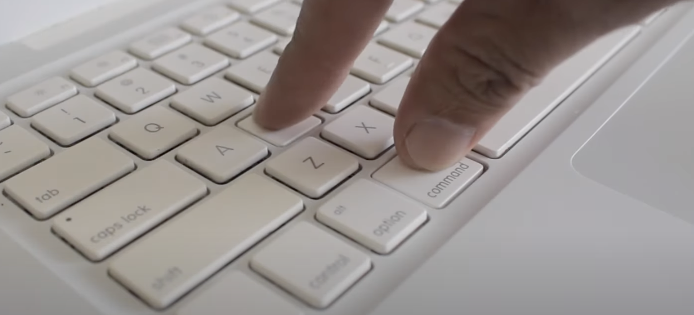
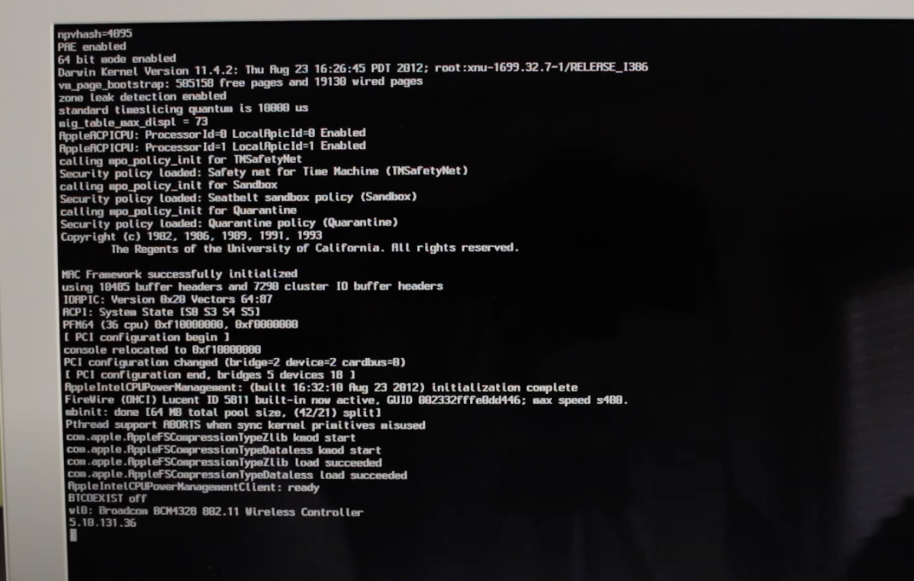

<!--- When running hugo new every site inherits this content :) -->


## About
I have recently bought an old-school MacBook 2.1 with an Intel-Core-Duo processor and I stumbled across some major issues. The seller left an existing account with a root password on the MacBook. 

This post aims to showcase how to wipe user presets from a existing System and make the device "ready to sell". 

With that said - Let's reset our MacBook to factory settings!


## Steps

### 1) Shutdown 

First of all, lets shutdown our device: 


### 2) Accessing the "Single-User-Mode"-terminal

Now hold `CMD + S` while pressing the power Button on your MacBook. After that you will enter the Single-User-Mode-Terminal.




If everything went right - You will enter the Single-User-Terminal as root: 



### 3) Remounting the system:

Run the following command: 

```bash
mount -uw /
```


Running `mount -uw /` remounts it in read-write mode, allowing you to make changes to system files, perform repairs, or install updates.


- `mount`: This is the command used to mount filesystems.

- `-u`: This option updates the mount with new options. It indicates that you want to modify the existing mount 
rather than create a new one.

- `-w`: This option specifies that the filesystem should be mounted in read-write mode.

- `-`: This indicates the root filesystem, which is the top-level directory of the filesystem hierarchy.


### 4) Remove the initial Setup-Indicator-File

```bash
rm /var/db/.applesetupdone
```

**File Purpose:**

The `.applesetupdone` file is a hidden file located in the `/var/db/` directory on macOS. Its presence tells the operating system that the initial setup process has been completed.


**Effects of Deleting the File**

* **Triggers Setup Assistant:** Deleting the .applesetupdone file will cause macOS to believe that the setup process has not been completed. The next time the system is rebooted, the setup assistant will run again, prompting for the creation of a new administrative user account.

* **New Admin Account:** This is a common method used to regain access to a macOS system if the administrative account credentials are lost or forgotten. By creating a new administrative user, you can regain full control of the system.

### 5) Shutdown and follow the setup-dialog

```bash
shutdown -h now
```

**Breakdown of the Command**

* `shutdown`: This is the command used to bring the system down in a safe way.
* `-h`: This option stands for "halt." It tells the system to stop all processes and halt the machine.
* `now`: This argument specifies that the shutdown should occur immediately.

After the device is turned on again the following will happen / has happend: 

- The device is succesfully set to factory-settings and ready to reuse orresell
- You will enter the default setup-dialog
