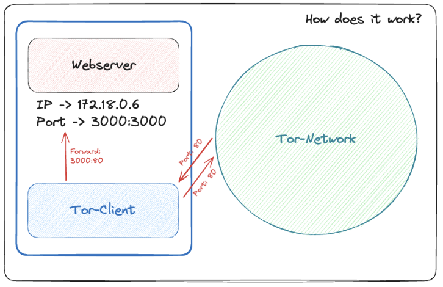

<!--- When running hugo new every site inherits this content :) -->


## Assets

Link: https://github.com/Stevan06v/nextjs-hidden-service.git

This blog-post is about deploying a Next.js application via a Tor hidden service to the onion network.

### About

The Next.js app showcases the power and flexibility of the Next.js framework, providing a robust and performant web application. By utilizing a Tor hidden service, the app can be accessed anonymously through the dark web, offering enhanced privacy and security.

### The Architecture 



### Getting Started

To run the Next.js app locally, follow these steps:

* Clone the repository:

```bash
git clone https://github.com/Stevan06v/nextjs-hidden-service.git
```

or just use this template repo.

### In case you are working on a windows machine:

Run the docker-daemon and double click the `start.cmd`-file.

Open your tor-client and access the output hidden-service-url 

Example output: 

```text
http://s5buptadf6hhh4dyfi6fah2stjrpz2ovdkquwv4xmjgrkzdmyhnciaqd.onion/
```

### In case you are working on a linux based machine:

```bash
bash start.sh
```

Open your tor-client and access the output hidden-service-url 

Example output: 
```text
http://s5buptadf6hhh4dyfi6fah2stjrpz2ovdkquwv4xmjgrkzdmyhnciaqd.onion/
```


#### Use it in your project
* COPY the DOCKERFILE out of `my-next-app`:

```bash
mv ./my-next-app/Dockerfile ./
```

* Remove `/my-next-app/`
* Create a new project 
* COPY the DOCKERFILE into the new project 
* Rename `build: ./my-next-app/` in the docker-compose-file to your new project folder
    * For the folder `/example` it would be  `build: ./example`

